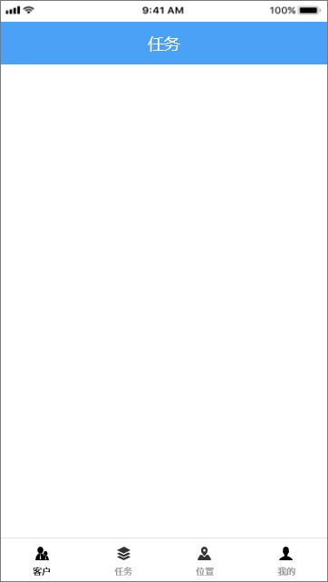

# 颜色
============================================================================================================
主色-科技蓝-#4AA1F6
辅色-柠檬黄-#F6C862
底色-底色灰-#F2F2F2

# 字体
思源黑体  12  

# UI框架

+ 设计稿尺寸：360 x 640
设计稿使用px绘制，开发尺寸应使用逻辑尺寸，设计稿1px对应安卓1dp，设计稿仅为参考，其他屏幕尺寸灵活适配即可，具体参考各页描述，后续尺寸描述都以dp为单位；

+ 顶部状态栏
顶部状态栏保留系统原始状态即可，不必特意设置。
设计稿中顶部状态栏高24dp

+ 顶部标题栏
顶部标题栏也基本保持系统原始状态即可，个别添加特殊功能的详见各页说明。
设计稿中的标题栏高48dp，颜色为主题色：#4AA1F6

+ 底部标签栏
底部标签栏原始工程中已实现，
标签栏使用com.google.android.material.bottomnavigation.BottomNavigationView实现
保留控件原始样式即可，控制图标等设置可参考原工程doc/标签栏设置.rd

+ 设计稿中标签栏:
高度48dp，四TAB平均宽:90dp，各ICON宽高:15dp，字号10，图标各自正常居中对齐
(仅为UI参考不必实现，工程使用原控件默认样式尺寸即可)

